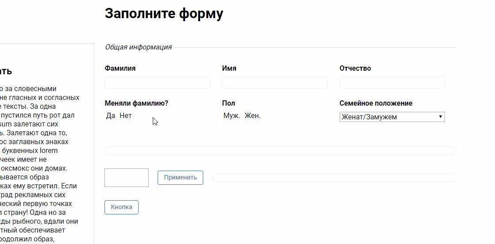

# Pinxter testing task

Testing task for work.  

Form, where user will be fill fields his data. After fill field: first name, last name, name father - progress bar will be change his background color and fill.

Below we can see block where user will be set percent, after click on "Accept" button, progress bar will be change and set width, which point user.

[Demo](http://dev-postnov.ru/works/testing-for-pinxter/)

